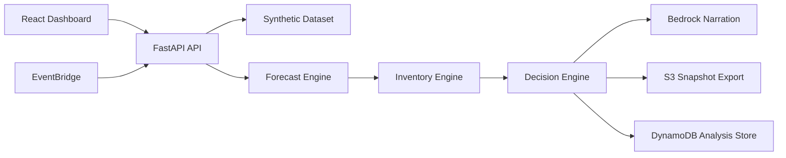

# Architecture

The system uses a single deterministic analysis pipeline with a thin AI narration layer.

### Design choices

- Keep all numeric outputs deterministic for testability.
- Use Bedrock only for explanation text.
- Keep the backend Lambda-compatible with a shared ASGI entry point.
- Keep the frontend lightweight and dependency-minimal.
